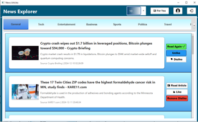

# Personalized News Recommendation System



## Project Description
The **Personalized News Recommendation System** is a comprehensive platform designed to provide users with tailored news articles based on their reading history and preferences. The system utilizes advanced NLP and machine learning techniques to analyze user behavior and deliver relevant content. Key features include:

- **User Registration and Login:** Secure and efficient user management.
- **Personalized Recommendations:** Suggests articles based on user preferences.
- **Category-based Browsing:** Organizes articles into categories for easy navigation.
- **Admin Dashboard:** Enables administrators to manage articles, view user activity logs, and generate reports.
- **Real-time Updates:** Ensures users have access to the latest news articles.

## How to Download and Execute the Project

### Prerequisites
Ensure you have the following software installed on your machine:

1. **Java Development Kit (JDK):** Version 11 or higher.
2. **Apache Maven:** For dependency management.
3. **MySQL Server:** For database storage.
4. **Git:** For cloning the repository.

### Steps to Download
1. Open a terminal or command prompt.
2. Clone the repository:
   ```bash
   git clone https://github.com/SachithPathiranage/Personalized-News-Recommendation-System-.git
   ```
3. Navigate to the project directory:
   ```bash
   cd Personalized-News-Recommendation-System
   ```

### Steps to Execute
1. **Configure the Environment:**
    - Create a `.env` file in the main folder of the project.
    - Input the following details in the `.env` file:
      ```env
      NEWS_API_KEY=
      NEWS_API_KEY2=
      API_URL=https://newsapi.org/v2/top-headlines
      DB_URL=jdbc:mysql://localhost:3306/news_recommendation
      DB_USER=
      DB_PASSWORD=
      ```
    - **Parameter Descriptions:**
        - `NEWS_API_KEY`: Your primary API key for accessing news data from the News API.
        - `NEWS_API_KEY2`: A secondary API key for redundancy or extended usage limits.
        - `API_URL`: The base URL for fetching top headlines from the News API.
        - `DB_URL`: The JDBC connection URL for the MySQL database.
        - `DB_USER`: The username for accessing the MySQL database.
        - `DB_PASSWORD`: The password for accessing the MySQL database.


2. **Configure the Database:**
    - Create a new database in MySQL (e.g., `news_recommendation`).
    - Import the database schema from the `news_recommendation.sql` file.
   

3. **Build the Project:**
    - Use Maven to build the project:
      ```bash
      mvn clean install
      ```

4. **Run the News Categorization Model:**
    - Open the `News Categorization Model` folder in Visual Studio Code.
    - Open the PowerShell terminal.
    - Navigate to the directory using:
      ```bash
      cd ../News Categorization Model
      ```
    - Activate the virtual environment:
      ```bash
      venv\Scripts\activate
      ```
    - Start the Flask server:
      ```bash
      flask run
      ```


### Additional Information
- **Default Admin Credentials:**
    - Username: `a`
    - Password: `a`

- **Directory Structure:**
    - `src/main`: Contains the main application code.
    - `database`: Contains database scripts and schema.


